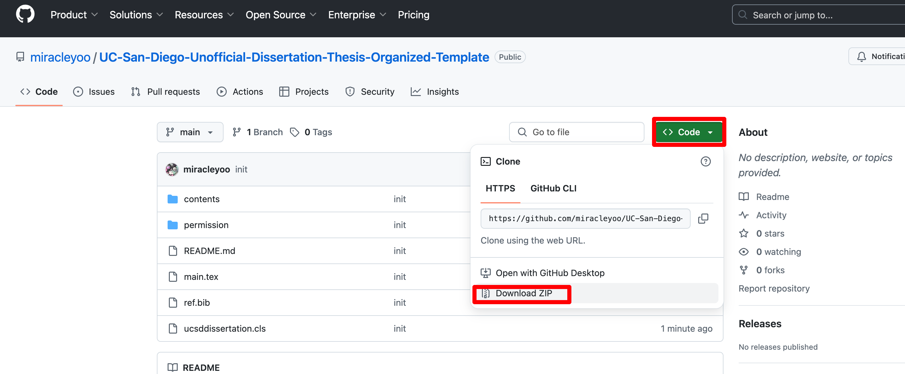
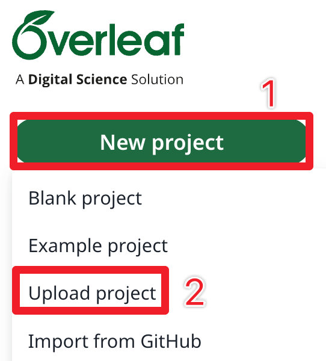
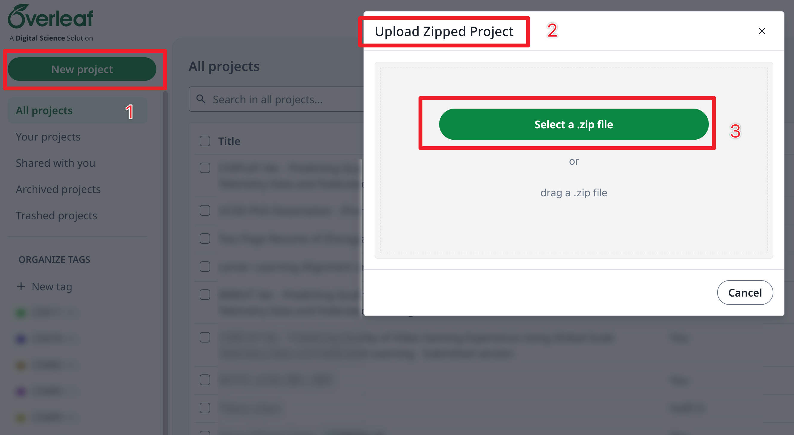
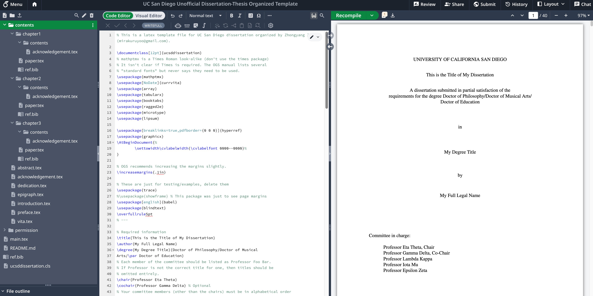
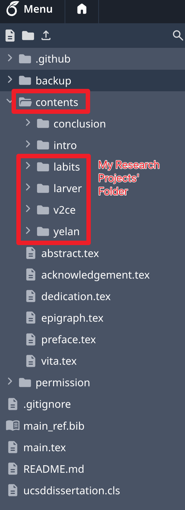
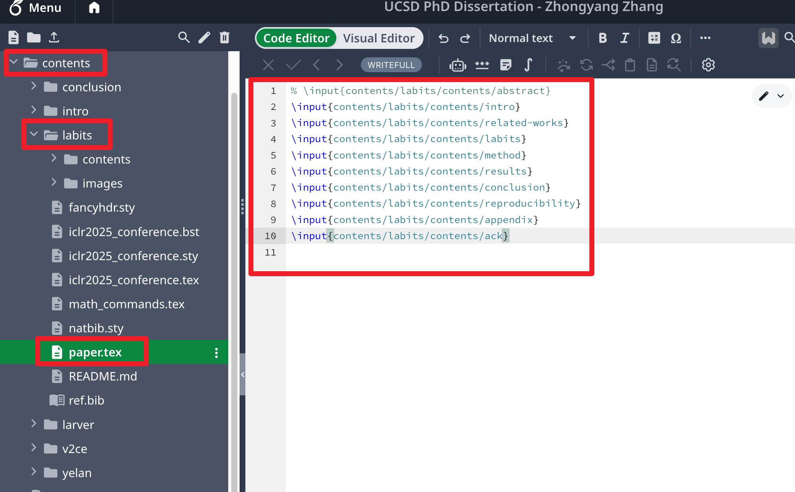
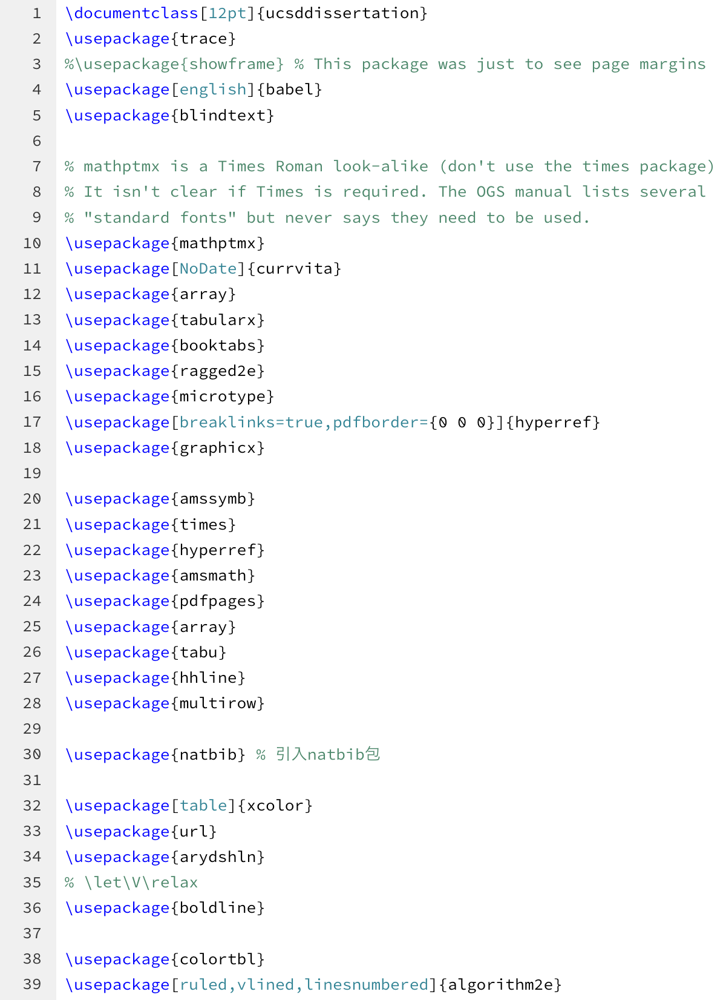

# How to Use Overleaf to Write Your Thesis in UC San Diego

**Author:** Zhongyang Zhang

**Email:** mirakuruyoo@gmail.com

## Basic Information

- Official Introduction to UCSD thesis template: [Link](https://grad.ucsd.edu/academics/preparing-to-graduate/dissertation-thesis-template.html)
- The organized unofficial UC San Diego thesis template wrote by me: [Link](https://github.com/miracleyoo/UC-San-Diego-Unofficial-Dissertation-Thesis-Organized-Template)
- Original raw unofficial UCSD thesis template (without a organized structure): [Link](https://github.com/stevecheckoway/ucsddissertation)

## Usage

1. Clean up the original latex documents for the papers you are going to use as a part/chapter of the thesis, delete the unused figure and tex files, remove the commented out paragraphs, and download these projects as a folder/zip file to your local device.

2. Download the unofficial UCSD thesis template as a zip file.
   

3. Start a new overleaf project from this zip file.
   
   

4. This is what you'll get after uploading the zip file of the compressed unofficial UCSD PhD dissertation template.
   

5. Upload all your downloaded personal overleaf project folders under the `contents` folder.
   

6. In your original each project's folder, there must be a document like `main.tex` which serves as the entry point of that project and contains a `\documentclass`. However, now, in the thesis project, you need a separate entry point, and each project should have only one `\documentclass` line. Therefore, it's highly recommended that you add a `paper.tex` file under every uploaded project folder, avoid any `\usepackage`, `\title`, `\author`, and other control sentences, simply only keep the main content. Lastly, remember to remove the abstract section for each project. Your thesis will only have one abstract, and these papers are serving as a chapter only and don't need an abstract.
   

7. Replace the figure's paths used in the `\includegraphics`, for example, from `images/sample.png` to `contents/yelan/images/sample.png`. This is necessary because the folder structure and the root directory have been changed.

8. Also, it's a good practice to write the `abstract`, `dedication`, `vita`, `preface`, `epigraph`, `acknowledgement`, `conclusion` of your thesis in separate files, also put under the contents folder.

9. In your `main.tex` file for the entire thesis project, make sure to import all the packages used in all your selected research papers, remove the duplication, and solve the conflicts.
   

10. Input all these contents using commands `\input`.

11. In the `\bibliography` sentence, make sure to include not only the thesis-level reference file, but also all the reference files in each of your selected project, like: `\bibliography{main_ref, contents/yelan/ref, contents/v2ce/ref, contents/labits/ref,contents/larver/ref}`.

12. Remove all the duplicated citation items. This can be done easily using the error log of the Overleaf. Also, fixing the errors related to citations and references by this chance. Common errors include `no key, author in <CITATION_ITEM>`, `empty author in <CITATION_ITEM>`, `to sort, need author or key in <CITATION_ITEM>`, `Repeated entry : <CITATION_ITEM>`.

13. Write the `abstract`, `dedication`, `vita`, `preface`, `epigraph`, `acknowledgement`, `conclusion` parts. Make sure you mentioned which chapter is based on which research paper at the end of the `acknowledgement` section. For example:
    ```tex
    Chapter 1, in full, is based on the paper from Zhongyang Zhang, Kaidong Chai, Haowen Yu, Ramzi Majaj, Francesca Walsh, Edward Wang, Upal Mahbub, Hava Siegelmann, Donghyun Kim, and Tauhidur Rahman, "Neuromorphic high-frequency 3D dancing pose estimation in dynamic environment" published in Neurocomputing, Volume 547, 2023, 126388, ISSN 0925-2312. The dissertation author is the primary investigator and author of this paper.
    
    Chapter 2, in full, is based on the paper from Zhongyang Zhang, Shuyang Cui, Kaidong Chai, Haowen Yu, Subhasis Dasgupta, Upal Mahbub, and Tauhidur Rahman, "V2CE: Video to Continuous Events Simulator" published in 2024 IEEE International Conference on Robotics and Automation (ICRA), Yokohama, Japan, 2024, pp. 12455-12461. The dissertation author is the primary investigator and author of this paper.
    
    Chapter 3, in part, is based on the paper from Zhongyang Zhang, Jiacheng Qiu, 
    Gert Cauwenberghs, Upal Mahbub, and Tauhidur Rahman, "Larver: Learning Alignment and Representation for Versatile Event Regeneration" currently being prepared for submission. The dissertation author is the primary investigator and author of this paper.
    ```

14. Also, at the end of each chapter, add a separate acknowledgement paragraph saying the same thing:
    ```tex
    \paragraph{Acknowledgments}
    
    Chapter 1, in full, is based on the paper from Zhongyang Zhang, Kaidong Chai, Haowen Yu, Ramzi Majaj, Francesca Walsh, Edward Wang, Upal Mahbub, Hava Siegelmann, Donghyun Kim, and Tauhidur Rahman, "Neuromorphic high-frequency 3D dancing pose estimation in dynamic environment" published in Neurocomputing, Volume 547, 2023, 126388, ISSN 0925-2312. The dissertation author is the primary investigator and author of this paper.
    ```

15. Make sure the caption of each figure is not too long. According to the UCSD GEPA requirements, each figure's caption should be no longer than two lines in the figure index page. If you need it to be longer, use `\caption[SHORT_CAPTION]{LONG_CAPTION}` instead. In this way, the figure caption in the index page will use the short version, and the actual caption in the main text keeps using the longer one.

16. Proofread and make sure there is no unrecognized references. E.g., `\ref{fig:sample}` turns out not finding the figure with this label. An easy solution is to download the compiled thesis pdf, and search `?`. The unrecognized reference will result in a `?` During compilation.

17. Solve all the errors left in the error log.

18. Done. Congratulation! 

## Main File Sample

```tex
\documentclass[12pt]{ucsddissertation}
% Include all necessary packages
\usepackage{xxx}
\usepackage{xxx}

\title{YOUR THESIS TITLE}
\author{YOUR NAME}
\degree{DEPARTMENT}{DEGREE LEVEL}
\chair{YOUR COMMITTEE CHAIR}
% List all your committee members' name in the alphabetical order of their last name
\committee{xxx}
\committee{xxx}

\degreeyear{YOUR GRADUATION YEAR}

% Start the document
\begin{document}

% Begin with frontmatter and so forth
\frontmatter
\maketitle
\makecopyright
\makesignature

% Optional
\input{contents/dedication}

% Optional
\input{contents/epigraph}

% Next comes the table of contents, list of figures, list of tables,
% etc. If you have code listings, you can use \listoflistings (or
% \lstlistoflistings) to have it be produced here as well. Same with
% \listofalgorithms.
\tableofcontents
\listoffigures
\listoftables

% Preface (Optional)
\input{contents/preface}

% Your fancy acks here. Keep in mind you need to ack each paper you
% use. See the examples here. In addition, each chapter ack needs to
% be repeated at the end of the relevant chapter.
\input{contents/acknowledgement}

% Stupid vita goes next
\input{contents/vita}

% Put your maximum 350 word abstract here.
\input{contents/abstract}

% This is where the main body of your dissertation goes!
\mainmatter

% Optional Introduction
\input{contents/intro/intro}

% Chapter 1
\chapter{CHAPTER 1's TITLE}
\input{contents/chapter1/paper}

% Chapter 2
\chapter{CHAPTER 2's TITLE}
\input{contents/chapter2/paper}

% Chapter 3
\chapter{CHAPTER 3's TITLE}
\input{contents/chapter3/paper}

% Chapter 4
\chapter{CHAPTER 4's TITLE}
\input{contents/chapter4/paper}

% Conclusion
\chapter{Summary and Future Work}
\input{contents/conclusion/conclusion}

\appendix

% Stuff at the end of the dissertation goes in the back matter
\backmatter
\bibliographystyle{plain} % Or whatever style you want like plainnat
\bibliography{main_ref, contents/chapter1/ref, contents/chapter2/ref, contents/chapter3/ref,contents/chapter4/ref}

\end{document}
```

